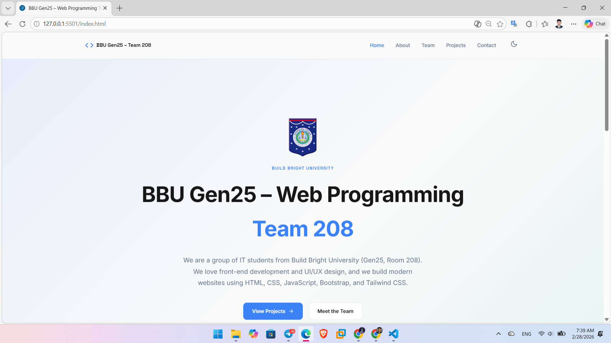

# BBU Gen25 — Team 208 | Web Programming Website

## Project Snapshot



This repository contains the academic group website developed by **Build Bright University (BBU), Generation 25, Team 208** for the **Web Programming** course.

The project demonstrates collaborative front-end development through a structured, multi-page static website that combines semantic HTML, modern CSS architecture, and JavaScript interactivity.

## Academic Context

- **Course:** Web Programming
- **Institution:** Build Bright University (BBU)
- **Generation:** 25
- **Team:** 208
- **Project Type:** Academic Group Assignment
- **Website Type:** Static Multi-Page Website
- **Development Scope:** Front-End Only (no backend, no database, no admin panel)

## Key Features

- Multi-page portfolio website for team presentation and project showcasing
- Responsive interface across desktop, tablet, and mobile breakpoints
- Modern UI with reusable design system and modular CSS structure
- Theme-aware styling and polished interaction patterns
- Team profile section with role-focused presentation
- Contact page with client-side form validation

## Live Demo

- **Team Website:** _Coming soon (add deployment URL here)_
- **Suggested hosting:** GitHub Pages / Netlify / Vercel

## Website Pages

- `index.html` — Home page (overview and introduction)
- `about.html` — Team background and academic context
- `team.html` — Team member profiles and roles
- `projects.html` — Individual and team project showcase
- `contact.html` — Contact information and inquiry form
- `github.html` — Tailwind-based special showcase page

## Featured Projects

### 1) Personal Portfolio Website

- **Owner:** Pich Chanthorn
- **Role:** Frontend Developer / Team Lead
- **Impact Summary:** Built a clean, responsive portfolio interface to present profile, technical skills, projects, and experience in a professional format.
- **Technologies:** HTML, CSS, JavaScript
- **Live Demo:** [https://pichchanthorn.github.io/bbu-gen25-team208-website/](https://pichchanthorn.github.io/bbu-gen25-team208-website/)
- **Repository:** [https://github.com/pichchanthorn/bbu-gen25-team208-website?tab=readme-ov-file](https://github.com/pichchanthorn/bbu-gen25-team208-website?tab=readme-ov-file)

### 2) Educational Platform Landing Page

- **Owner:** Pich Chanthorn
- **Role:** Frontend Developer
- **Impact Summary:** Delivered a conversion-oriented landing page with structured content sections, responsive layout, and clear call-to-action flow.
- **Technologies:** HTML, CSS, Bootstrap, JavaScript

> Each showcased project includes ownership and role attribution to clearly represent individual contribution within the group assignment.

## Contribution Breakdown

| No. | Member | Role | Primary Contribution Scope |
| --- | --- | --- | --- |
| 1 | **Pich Chanthorn** | Frontend Developer / Team Lead | Architecture decisions, core UI implementation, project integration |
| 2 | Mao Vibol | UI/UX Designer | Layout planning, visual consistency, user experience refinement |
| 3 | San Kimhor | JavaScript Developer | Interactive behaviors, scripting logic, dynamic UI features |
| 4 | Khy Samrith | Frontend Developer | Page implementation, responsive styling, component-level support |
| 5 | Ratana Oudom | Content & Testing | Content preparation, proofreading, quality checks and validation |

## Technologies & Tools

- **HTML5** — Semantic page structure
- **CSS3** — Styling, layout, and responsive design
- **JavaScript (Vanilla)** — Interactivity and front-end logic
- **Bootstrap** — Responsive component and layout utilities
- **Tailwind CSS** — Utility-first styling (used in `github.html`)
- **Git & GitHub** — Version control and project collaboration

## Folder Structure

```text
BBU-GEN25-TEAM-208/
├── .vscode/
├── assets/
│   └── images/
│       ├── projects/
│       ├── screenshots/
│       └── team/
├── css/
│   ├── base.css
│   ├── layout.css
│   ├── components.css
│   ├── pages.css
│   └── style.css
├── js/
│   ├── script.js
│   ├── snow.js
│   └── github.js
├── index.html
├── about.html
├── team.html
├── projects.html
├── contact.html
├── github.html
└── README.md
```

## Project Objectives

- Apply theoretical and practical knowledge from the Web Programming course
- Practice scalable front-end structure and maintainable code organization
- Strengthen teamwork through role-based contribution and delivery
- Produce an academic portfolio artifact suitable for GitHub presentation

## License

This project is developed **for educational purposes only** as part of the Web Programming course at **Build Bright University**.

 